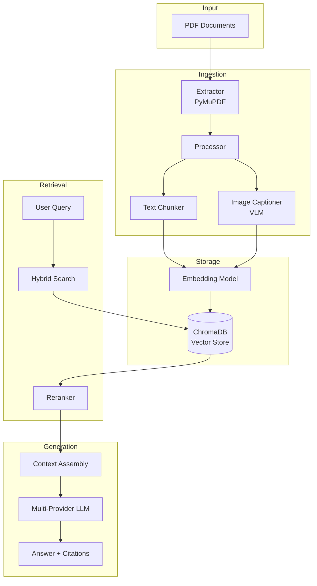

# System Architecture

Technical architecture documentation for the Production RAG system.

## System Overview

The Production RAG system implements a modular, pipeline-based architecture designed for scalability, maintainability, and extensibility.

### Design Principles

1. **Modularity**: Each component has a single, well-defined responsibility
2. **Provider Agnostic**: Abstract interfaces enable easy provider switching
3. **Multi-Modal**: Unified handling of text and visual information
4. **Production-Ready**: Comprehensive error handling, logging, and monitoring

## Architecture Diagram



## Component Details

### 1. Ingestion Layer

#### Extractor (`ingestion/extractors.py`)

**Purpose**: Extract raw content from PDF documents

**Technology**: PyMuPDF (fitz)

**Process**:
1. Open PDF file
2. Iterate through pages
3. Extract text blocks with position metadata
4. Extract images with size filtering
5. Return structured `Document` objects

**Key Classes**:
```python
class PDFExtractor:
    def extract_documents(pdf_path: str) -> List[Document]
```

**Document Schema**:
```python
@dataclass
class Document:
    text: str              # Extracted text or caption
    metadata: dict         # page_number, source, type
    image_data: bytes      # Raw image (if applicable)
```

#### Processor (`ingestion/processors.py`)

**Purpose**: Transform raw documents into searchable chunks

**Components**:

**TextChunker**:
*   Uses LangChain's `RecursiveCharacterTextSplitter`
*   Splits on natural boundaries (paragraphs, sentences)
*   Maintains context with overlap
*   Preserves metadata

**ImageCaptioner**:
*   Sends images to Vision Language Model
*   Generates detailed descriptions
*   Focuses on: visual content, text in image, context
*   Returns caption as searchable text

**Configuration**:
```python
CHUNK_SIZE = 1000        # Target chunk size
CHUNK_OVERLAP = 200      # Overlap for context
MIN_IMAGE_SIZE = 2000    # Filter decorative images
```

#### Storage (`ingestion/storage.py`)

**Purpose**: Persist embeddings and enable similarity search

**Technology**: ChromaDB

**Operations**:
*   `add_documents()`: Batch insert with embeddings
*   `search()`: Vector similarity search
*   `reset()`: Clear database

**Embedding Models**:
*   OpenAI: `text-embedding-3-small`
*   Google: `text-embedding-004`
*   Fallback: Sentence Transformers

### 2. Retrieval Layer

#### Hybrid Search (`retrieval/search.py`)

**Purpose**: Find relevant context for user queries

**Algorithm**:

```python
def retrieve_and_rerank(query: str) -> List[Chunk]:
    # 1. Vector Search
    candidates = vector_store.search(query, top_k=10)
    
    # 2. (Future) Keyword Search
    # bm25_results = keyword_search(query)
    
    # 3. Reranking
    reranked = sort_by_distance(candidates)
    
    # 4. Top-K Selection
    return reranked[:5]
```

**Reranking Strategy**:
*   Current: Distance-based sorting
*   Planned: Cross-encoder reranking

**Metadata Filtering**:
*   Filter by source document
*   Filter by page range
*   Filter by content type (text/image)

### 3. Generation Layer

#### Multi-Provider LLM (`generation/rag.py`)

**Purpose**: Generate answers using retrieved context

**Architecture**:

```python
# Abstract Interface
class LLMClient(ABC):
    @abstractmethod
    def generate(prompt: str, context: str) -> GenerationResult

# Concrete Implementations
class OpenAIClient(LLMClient)
class AnthropicClient(LLMClient)
class GoogleClient(LLMClient)
class DeepSeekClient(LLMClient)
class OllamaClient(LLMClient)

# Factory Pattern
class LLMFactory:
    @staticmethod
    def create_client(provider: str) -> LLMClient
```

**Context Assembly**:

```python
def format_context(chunks: List[Chunk]) -> str:
    context = ""
    for i, chunk in enumerate(chunks):
        source = f"Source {i+1} (Page {chunk.page})"
        if chunk.type == "image":
            context += f"[IMAGE: {chunk.text}]\n"
        else:
            context += f"{chunk.text}\n"
    return context
```

**Prompt Structure**:
```
System: {RAG_SYSTEM_PROMPT}

Context:
{formatted_context}

Question: {user_query}

Answer:
```

#### Cost Tracking

**Implementation**:
```python
@dataclass
class GenerationResult:
    content: str
    model_name: str
    usage: dict  # input_tokens, output_tokens
    provider: str

def calculate_cost(result: GenerationResult) -> float:
    pricing = PRICING[result.model_name]
    input_cost = (result.usage['input'] / 1_000_000) * pricing['input']
    output_cost = (result.usage['output'] / 1_000_000) * pricing['output']
    return input_cost + output_cost
```

## Data Flow

### Ingestion Flow

```
PDF File
  ↓
[Extract] → Text Blocks + Images
  ↓
[Process] → Text Chunks + Image Captions
  ↓
[Embed] → Vector Representations
  ↓
[Store] → ChromaDB Collection
```

### Query Flow

```
User Question
  ↓
[Embed] → Query Vector
  ↓
[Search] → Top-K Candidates (Vector DB)
  ↓
[Rerank] → Top-N Final Chunks
  ↓
[Assemble] → Context String
  ↓
[Generate] → LLM API Call
  ↓
Answer + Citations + Cost
```

## Scalability Considerations

### Current Limitations

*   **Storage**: ChromaDB is file-based (single-machine)
*   **Concurrency**: No built-in request queuing
*   **Caching**: No response caching

### Production Enhancements

**For Large-Scale Deployment**:

1. **Vector Database**:
   *   Replace ChromaDB with Pinecone/Weaviate/Qdrant
   *   Enable distributed storage
   *   Add sharding for horizontal scaling

2. **API Layer**:
   *   Wrap in FastAPI/Flask
   *   Add request queuing (Celery/RQ)
   *   Implement rate limiting

3. **Caching**:
   *   Cache embeddings (Redis)
   *   Cache LLM responses (semantic cache)
   *   Cache retrieval results

4. **Monitoring**:
   *   Add OpenTelemetry tracing
   *   Track latency percentiles
   *   Monitor cost per query

## Security Considerations

### API Key Management

*   Keys stored in `.env` (not committed)
*   Loaded via `python-dotenv`
*   Validated at startup

### Data Privacy

*   No data sent to external services except configured LLM providers
*   Local vector storage (ChromaDB)
*   No telemetry by default

## Extension Points

### Adding New Providers

1. Implement `LLMClient` interface
2. Add to `LLMFactory`
3. Update `MODELS` in `config.py`
4. Add pricing to `PRICING` dict

### Custom Reranking

1. Implement reranker in `retrieval/search.py`
2. Options:
   *   Cross-encoder (e.g., `ms-marco-MiniLM`)
   *   BM25 hybrid
   *   Custom scoring function

### Custom Embeddings

1. Modify `VectorStore` initialization
2. Options:
   *   Sentence Transformers
   *   Custom fine-tuned models
   *   Domain-specific embeddings

## Performance Characteristics

### Latency Breakdown

Typical query (5 chunks, GPT-4o-mini):
*   Embedding: 50-100ms
*   Vector search: 50-200ms
*   Reranking: 10-50ms
*   LLM generation: 1-2s
*   **Total**: 1.5-2.5s

### Throughput

Single instance:
*   Ingestion: ~10-20 pages/minute (with VLM)
*   Queries: ~20-30 queries/minute (limited by LLM)

### Cost Profile

Per 1000 queries (GPT-4o-mini):
*   Embeddings: ~$0.01
*   Generation: ~$1.00
*   **Total**: ~$1.01

## Technology Stack

| Component | Technology | Purpose |
|-----------|-----------|---------|
| PDF Parsing | PyMuPDF | Extract text/images |
| Text Splitting | LangChain | Semantic chunking |
| Vector DB | ChromaDB | Similarity search |
| Embeddings | OpenAI/Google | Text vectorization |
| LLM | Multi-provider | Answer generation |
| Testing | pytest | Unit testing |
| Evaluation | RAGAS | Quality assessment |
